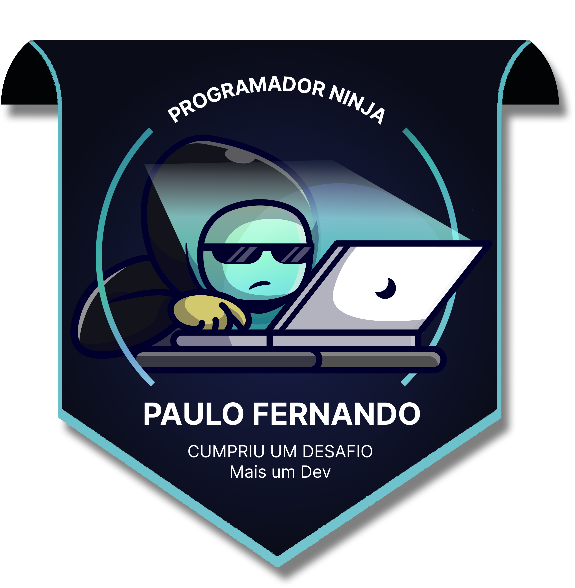

# Ola, eu sou Paulo Ferreira e sou um Desenvolvedor web

<h4 align="center">

</h4>

<table border="0" cellspacing="0" cellpadding="0" align="center">
  <tr>
    <td style="border: 0";>
      
    </td>
    <td style="border: 0";>
      <h4 align="center">Projetos em destaque</h4>
      

        Repositorio modelo de Portfolio <a href="https://github.com/PauloTIgit/Portfolio">Click aqui<a>
      

    </td>
  </tr>
</table>

  <h4>Selo do Desafio mais um DEV</h4>
  

|  |  |  |
| :-: | :-: | :-: |

|  |  |
| :-: | :-: |

